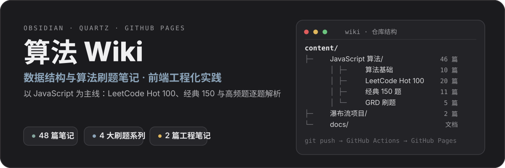
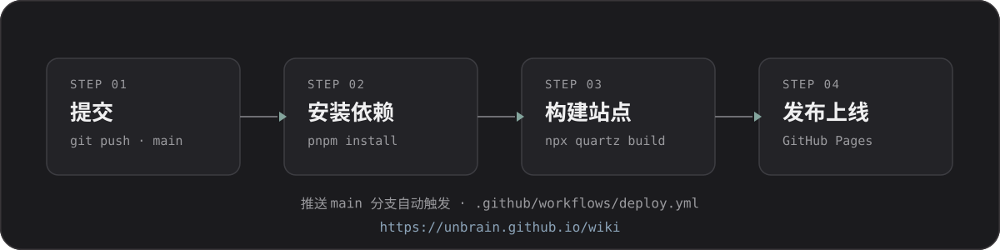

<p align="center">
  
</p>

<p align="center">
  
  
  
  
</p>

# 算法 Wiki

以 JavaScript 为主线的数据结构与算法刷题笔记，以及前端工程化项目实践。笔记在 Obsidian 中写作，由 Quartz 生成静态站点，GitHub Actions 自动构建并部署到 GitHub Pages。

<p align="center">
  <a href="https://unbrain.github.io/wiki"><b>访问在线站点 →</b></a>
</p>

## 内容导航

<p align="center">
  
</p>

### JavaScript 算法（46 篇）

| 系列 | 篇数 | 内容 |
| --- | --- | --- |
| 算法基础 | 10 | 复杂度、栈与队列、链表、集合与字典、树、图、堆、排序、分治、动态规划、回溯 |
| LeetCode Hot 100 | 20 | 链表 / 二叉树 / 双指针 / 二分 / 哈希 / 动态规划 / 回溯等专题笔记与刷题日志 |
| 经典 150 题 | 11 | 数组与字符串、双指针与滑动窗口、链表、栈、哈希表、二叉树、位运算、Kadane |
| GRD 刷题 | 5 | 数组 / 链表 / 栈 / 字符串 / 二叉树的高频题逐题解析 |

### 瀑布流项目（2 篇）

- 项目骨架搭建：Vite vs Webpack、Vite 8 新特性、Tailwind 集成与工程化配置
- 物料解决方案：移动端与 PC 端差异、组件库设计

### 文档

- `docs/`：Quartz 配置、功能与使用文档

## 本地开发

<p align="center">
  
</p>

```bash
pnpm install     # 安装依赖
npx quartz build # 构建到 public/
npx quartz serve # 本地预览 http://localhost:8080
```

## 部署

<p align="center">
  
</p>

推送 `main` 分支即触发 `.github/workflows/deploy.yml` 自动构建并发布到 GitHub Pages。

<p align="center">
  
</p>

## 技术栈

<p align="center">
  
</p>

Obsidian · Quartz v5 · TypeScript · GitHub Actions
