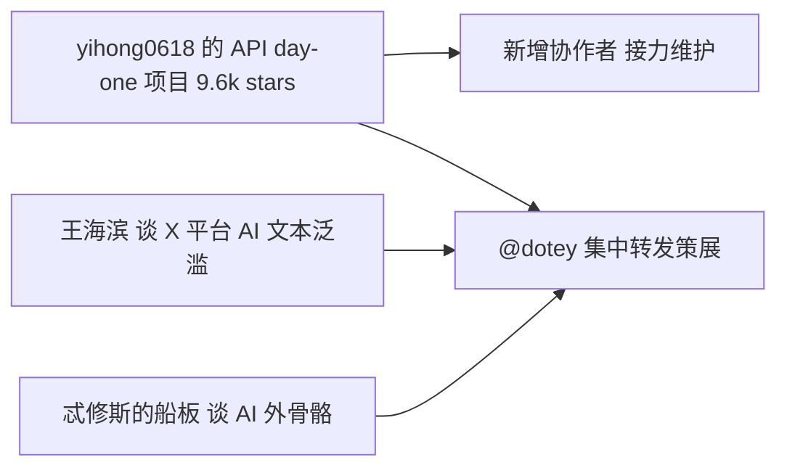

# 🐦 AI 情报日报（2026-09-02）

## ⚡ 30 秒速览

- **开源接力**：yihong0618 在 ChatGPT API 公布首日写的项目已达 9.6k stars，并新增协作者接力维护。
- **Claude Max**：被指因 1.5 倍消耗而慢，重度用户一天即可打满额度自然重置。
- **AI 创作**：小说作者称 AI 是作者的“外骨骼”，是其约两年前入行的关键变量。
- **平台生态**：王海滨复盘 X 的奖励机制曾引来天量 AI 生成文本，称“AI 杀死了生产端——以及需求端”。

## 🔥 今日热点新知

- **[yihong0618 的 ChatGPT API day-one 项目达 9.6k stars]** — 该项目是他在 ChatGPT API 公布首日所写，如今累计 9.6k stars 并新增协作者，他形容这是“手写时代和 agent 时代的接力”。个人抢跑新 API 的工具项目能滚到近万 star，说明 agent 工具链仍是开源社区的刚需赛道。[来源](https://x.com/dotey/status/2094816158528549084)
- **[Claude Max 被指 1.5 倍消耗导致慢]** — @dotey 发现 Claude Max 慢的原因是 1.5 倍消耗，因此日常只选 Fable high 或 Opus high（原文表述）。订阅档位的消耗倍率直接决定响应速度，重度用户已在按倍率精细选择模式。[来源](https://x.com/dotey/status/2094818637324447842)
- **[Claude 额度一天打满自然重置]** — @dotey 的 Claude 用量仅一天就触发上限并自然重置，感叹“今天晚上又睡不好觉了”。配额周期成了重度用户日常体验的一部分，侧面反映高频 agent 式使用对配额的压力。[来源](https://x.com/dotey/status/2094855409844527398)
- **[小说作者：AI 是作者的“外骨骼”]** — “忒修斯的船板”回顾约 2 年前决定入行小说业，关键变量正是 AI 的快速发展：AI 能把作者从卡文、赶稿的地狱中解脱。AI 对创作行业的影响已从工具层渗透到个人职业决策层。[来源](https://x.com/dotey/status/2094803658466603016)
- **[王海滨：AI 杀死了生产端——以及需求端]** — 他复盘马斯克请尼基塔管理 X 的时期：奖励机制让大量蓝V账号带着天量 AI 生成文本涌入平台。平台激励与 AI 产能叠加，会同时冲击内容的生产与需求两端。[来源](https://x.com/dotey/status/2094819090422444268)
- **[额度没用完也要给 AI 派活]** — @dotey 观察到一种“小老板心态”：Token 快刷新、额度还剩很多时，用户会绞尽脑汁给 AI 派活，像极了怕员工偷懒摸鱼的小老板。订阅额度经济学正在制造“用满才不亏”的行为驱动。[来源](https://x.com/dotey/status/2094815914621300937)

## 📋 账号动态

**@dotey**：当天观察聚焦 Claude 重度使用——Claude Max 慢源于 1.5 倍消耗，所以日常只选 Fable high 或 Opus high；另一条 Claude 用量一天就打满自然重置，自嘲“今晚又睡不好觉”。转发侧集中策展 AI 内容生态：yihong0618 的 ChatGPT API day-one 项目达 9.6k stars 并新增协作者、小说作者“忒修斯的船板”称 AI 是作者的外骨骼、王海滨复盘 X 平台蓝V与天量 AI 生成文本的泛滥。深夜还感叹额度没用完就得绞尽脑汁给 AI 派活，活像怕员工摸鱼的小老板。

## 🔍 值得关注的信号

**🎯 新技术 / 新产品**
- **个人 day-one 项目滚到 9.6k stars**：yihong0618 在 ChatGPT API 公布首日写的项目已达 9.6k stars，并新增协作者。解读：抢跑新 API 的个人项目能短期积累近万 star，且维护从单人转向协作“接力”，说明 agent 工具链仍是开源高需求赛道。证据：@dotey 23:54 转发 yihong0618 推文。

**📈 行业风向 / 关键表态**
- **AI 成为职业决策变量**：小说作者“忒修斯的船板”自述约 2 年前入行小说业的关键变量是 AI 的快速发展，AI 像作者的外骨骼。解读：AI 对创作行业的影响已进入“改变个人职业选择”层面，值得内容行业持续跟踪。证据：@dotey 14:54 转发。
- **“AI 杀死了生产端——以及需求端”**：王海滨复盘马斯克请尼基塔管理 X 时期，奖励机制让大量蓝V携带天量 AI 生成文本涌入。解读：平台激励与 AI 产能叠加会同时冲击供给与需求两端，是内容平台治理的前车之鉴。证据：@dotey 22:21 转发。

**⚠️ 风险与批判**
- **信源单点依赖**：当日全部关键内容均经 @dotey 一人观察或转发，无第二信源交叉验证。解读：“9.6k stars”“天量 AI 文本”等数字与判断应视为单一策展路径的二手信息，采信前需另行核实。证据：素材 7 条推文全部来自 @dotey 时间线。
- **配额焦虑被制度性制造**：额度没用完也要绞尽脑汁给 AI 派活，用户行为被订阅周期而非真实需求驱动。解读：这类心态可能催生低价值用量与浪费，也显示订阅制定价对使用行为的强塑造力。证据：@dotey 23:53 推文。

## 🧠 复盘与举一反三

- **连点成线**：A（Claude Max 因 1.5 倍消耗而慢）+ B（额度一天打满自然重置）+ C（额度没用完也要派活）→ 对重度用户而言，瓶颈正从“模型能力”转向“订阅额度经济学”。因为消耗倍率决定模式选择、配额周期驱动使用节奏，额度已变成像流量一样需要被主动管理的资源。
- **换个视角**：
  - 工程师：把消耗倍率与配额周期写进日常工作流——关键任务才用 Opus high 这类高档位，批量杂活集中排在额度刷新前跑完，避免额度空转或提前打满。
  - 创业者：“配额焦虑”是真实且普遍的痛点，配额监控、多档位路由、按额度余量自动派活的 agent 任务排程，都是可小成本验证的工具方向。
- **反方观点**：“瓶颈在额度而非能力”建立在当前定价结构之上。若厂商竞争加剧后下调消耗倍率、放宽配额或降价，配额焦虑会迅速消解，用户行为重新由真实需求驱动，围绕配额做优化的工具与工作流价值也将随之缩水。

## 📊 附录

### A1. 热点对比表

| 热点 | 发布者 | 类型 | 关键细节 | 为什么重要 |
|---|---|---|---|---|
| ChatGPT API day-one 项目破 9.6k stars | yihong0618（@dotey 转发） | 开源项目 | 9.6k stars、新增协作者 | 个人 agent 工具项目高速增长并进入协作维护 |
| Claude Max 1.5 倍消耗 | @dotey | 产品观察 | 慢源于 1.5 倍消耗，改选 Fable high / Opus high | 消耗倍率影响模式选择与响应速度 |
| Claude 额度一天重置 | @dotey | 产品观察 | 一天打满额度自然重置 | 重度使用下配额成为紧约束 |
| AI 是作者的“外骨骼” | 忒修斯的船板（@dotey 转发） | 行业观察 | 约 2 年前因 AI 入行小说业 | AI 影响渗透到职业决策层 |
| AI 杀死生产端与需求端 | 王海滨（@dotey 转发） | 行业批判 | 蓝V携天量 AI 生成文本涌入 X | 平台激励放大 AI 内容供给 |
| 额度没用完也要派活 | @dotey | 用户心态 | “小老板心态”比喻 | 订阅额度经济学塑造使用行为 |

### A2. 信息结构图

### A3. 质量自检（审校留痕）

| 检查项 | 结果 |
|---|---|
| 每条热点链接逐字来自素材 | ✅ |
| 无编造互动数据/数字/名词 | ✅ |
| 账号动态无空话 | ✅ |
| 每条信号都有“为什么” | ✅ |
| 附录表格与正文一致 | ✅ |
