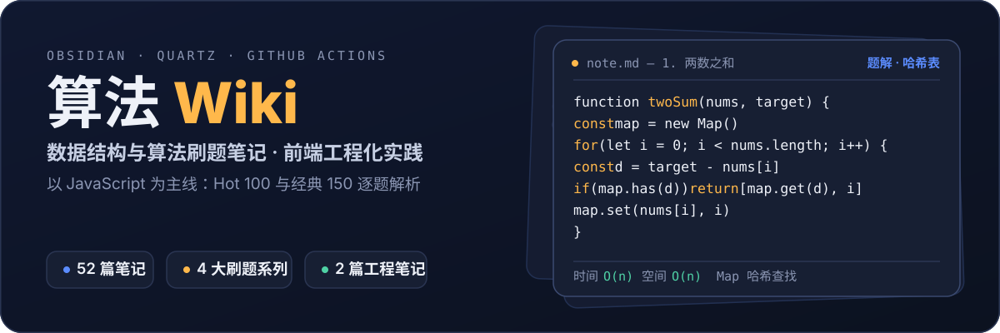

  
  
  
  

本站以 JavaScript 为主线，记录数据结构与算法刷题笔记与前端工程化实践。笔记在 Obsidian 中写作，Quartz 生成静态站点，GitHub Actions 自动部署到 GitHub Pages。

> [!note] 快速开始
> - 左侧**目录**按系列浏览全部笔记；**搜索**可直达任意题目或主题
> - 右侧**关系图谱**可以看到笔记之间的知识关联
> - 不知道从哪开始？建议先走完下方的「算法基础」系列

## 内容导航

  

  

### JavaScript 算法

#### 算法基础

从零建立数据结构与算法框架，推荐按顺序学习。

| 天 | 主题 | 笔记 |
| --- | --- | --- |
| 01 | 复杂度分析、栈与队列 | [[JavaScript 算法/算法基础/JavaScript 算法基础第一天|算法基础 第一天]] |
| 02 | 链表与原型链 | [[JavaScript 算法/算法基础/JavaScript 算法基础第二天|算法基础 第二天]] |
| 03 | 集合与字典（Set / Map / 哈希） | [[JavaScript 算法/算法基础/JavaScript 算法基础第三天|算法基础 第三天]] |
| 04 | 树与二叉树遍历（BFS / DFS） | [[JavaScript 算法/算法基础/JavaScript 算法基础第四天|算法基础 第四天]] |
| 05 | 图与邻接表 | [[JavaScript 算法/算法基础/JavaScript 算法基础第五天|算法基础 第五天]] |
| 06 | 堆与优先队列（Top-K） | [[JavaScript 算法/算法基础/JavaScript 算法基础第六天|算法基础 第六天]] |
| 07 | 排序算法 | [[JavaScript 算法/算法基础/JavaScript 算法基础第七天|算法基础 第七天]] |
| 08 | 分治算法 | [[JavaScript 算法/算法基础/JavaScript 算法基础第八天|算法基础 第八天]] |
| 09 | 动态规划与贪心 | [[JavaScript 算法/算法基础/JavaScript 算法基础第九天|算法基础 第九天]] |
| 10 | 回溯算法 | [[JavaScript 算法/算法基础/JavaScript 算法基础第十天|算法基础 第十天]] |
| 11 | 数组转树（手写题） | [[JavaScript 算法/算法基础/JavaScript 算法基础第十一天|算法基础 第十一天]] |

#### LeetCode Hot 100

按专题分类的刷题记录，覆盖高频面试题。

- [[JavaScript 算法/LeetCode Hot100/LeetCode Hot100 链表|链表]]
- [[JavaScript 算法/LeetCode Hot100/LeetCode Hot100 二叉树|二叉树]]、[[JavaScript 算法/LeetCode Hot100/LeetCode Hot100 二叉树 二|二叉树（二）]]、[[JavaScript 算法/LeetCode Hot100/LeetCode Hot100 二叉树 三|二叉树（三）]]、[[JavaScript 算法/LeetCode Hot100/LeetCode Hot100 二叉树 回顾与总结|二叉树回顾与总结]]
- [[JavaScript 算法/LeetCode Hot100/LeetCode Hot100 双指针|双指针]]、[[JavaScript 算法/LeetCode Hot100/LeetCode Hot100 双指针 二|双指针（二）]]、[[JavaScript 算法/LeetCode Hot100/LeetCode Hot100 双指针 图|双指针与图]]
- [[JavaScript 算法/LeetCode Hot100/LeetCode Hot100 二分查找|二分查找]]
- [[JavaScript 算法/LeetCode Hot100/LeetCode Hot100 hash表|哈希表]]、[[JavaScript 算法/LeetCode Hot100/LeetCode Hot100 hash表 二|哈希表（二）]]
- [[JavaScript 算法/LeetCode Hot100/LeetCode Hot100 动态规划|动态规划]]
- [[JavaScript 算法/LeetCode Hot100/LeetCode Hot100 回溯|回溯]]
- [[JavaScript 算法/LeetCode Hot100/LeetCode Hot100 杂题|杂题]]

**刷题日志**

- [[JavaScript 算法/LeetCode Hot100/LeetCode Hot100|第 1 天：链表与二叉树]]
- [[JavaScript 算法/LeetCode Hot100/LeetCode Hot100 反转链表与课程表|第 2 天：反转链表与课程表]]
- [[JavaScript 算法/LeetCode Hot100/LeetCode Hot100 多数元素与除自身以外|第 3 天：多数元素与除自身以外]]
- [[JavaScript 算法/LeetCode Hot100/LeetCode Hot100 环形链表|第 4 天：环形链表]]
- [[JavaScript 算法/LeetCode Hot100/LeetCode Hot100 位运算与动态规划|第 5 天：位运算与动态规划]]
- [[JavaScript 算法/LeetCode Hot100/LeetCode Hot100 动态规划与贪心|第 6 天：动态规划与贪心]]

#### 经典 150 题

按专题整理的经典 150 题解法。

- **数组与字符串**：[[JavaScript 算法/经典 150/经典 150 数字 字符串|数字与字符串]]、[[JavaScript 算法/经典 150/经典 150 字符串|字符串]]、[[JavaScript 算法/经典 150/经典 150 区间|区间]]、[[JavaScript 算法/经典 150/经典 150 矩阵|矩阵]]、[[JavaScript 算法/经典 150/经典 150 Kadane 算法|Kadane 算法（最大子数组和）]]
- **双指针与滑动窗口**：[[JavaScript 算法/经典 150/经典 150 双指针|双指针]]、[[JavaScript 算法/经典 150/经典 150 滑动窗口|滑动窗口]]
- **哈希表**：[[JavaScript 算法/经典 150/经典 150 哈希表|哈希表]]
- **栈与链表**：[[JavaScript 算法/经典 150/经典 150 栈|栈]]、[[JavaScript 算法/经典 150/经典 150 链表|链表]]
- **二叉树与二叉搜索树**：[[JavaScript 算法/经典 150/经典 150 二叉树|二叉树]]、[[JavaScript 算法/经典 150/经典 150 二叉树 二|二叉树（二）]]、[[JavaScript 算法/经典 150/经典 150 二叉树层序遍历|二叉树层序遍历]]、[[JavaScript 算法/经典 150/经典 150 二叉搜索树|二叉搜索树]]
- **回溯**：[[JavaScript 算法/经典 150/经典 150 回溯|回溯]]
- **动态规划**：[[JavaScript 算法/经典 150/经典 150 一维动态规划|一维动态规划]]
- **位运算**：[[JavaScript 算法/经典 150/经典 150 位运算|位运算]]

#### GRD 刷题记录

高代表性题目的逐题解析，每题附思路与代码。

- [[JavaScript 算法/GRD/GRD 数组|GRD 数组]]：两数之和、三数之和、合并区间、盛最多水的容器
- [[JavaScript 算法/GRD/GRD 链表|GRD 链表]]：反转链表、环形链表、LRU 缓存
- [[JavaScript 算法/GRD/GRD 栈|GRD 栈]]：有效括号、最小栈、接雨水、柱状图最大矩形
- [[JavaScript 算法/GRD/GRD 字符串|GRD 字符串]]：回文串、字母异位词、最小覆盖子串
- [[JavaScript 算法/GRD/GRD 二叉树|GRD 二叉树]]：翻转二叉树、平衡二叉树、层序遍历
- [[JavaScript 算法/GRD/GRD 二叉搜索树|GRD 二叉搜索树]]：BST 最近公共祖先、验证 BST、第 K 小元素
- [[JavaScript 算法/GRD/GRD 堆|GRD 堆]]：奇偶跳、任务调度器、数据流的中位数、合并 K 个升序链表
- [[JavaScript 算法/GRD/GRD 动态规划|GRD 动态规划]]：爬楼梯、最大子数组和、零钱兑换
- [[JavaScript 算法/GRD/GRD 递归|GRD 递归]]：全排列、子集、电话号码的字母组合
- [[JavaScript 算法/GRD/GRD 矩阵|GRD 矩阵]]：螺旋矩阵
- [[JavaScript 算法/GRD/GRD 前缀树|GRD 前缀树]]：实现 Trie（insert / search / startsWith）

#### 解题思路

高频题目的完整思考过程拆解。

- [[JavaScript 算法/解题思路/322 零钱兑换|322 零钱兑换]]：状态定义、完全背包与 0-1 背包遍历方向辨析、换序问题与易错点
- [[JavaScript 算法/解题思路/54 螺旋矩阵|54 螺旋矩阵]]：四边界收缩法、指针逐格遍历、计数终止条件与边界对称收缩辨析

#### 瀑布流项目

前端工程化的实践记录。

- [[瀑布流项目/项目骨架搭建|项目骨架搭建]]：Vite vs Webpack、Vite 8 新特性、Tailwind 集成与工程化配置
- [[瀑布流项目/物料解决方案|物料解决方案]]：移动端与 PC 端差异、组件库设计

本站由 [Quartz](https://quartz.jzhao.xyz) 构建，构建与部署等仓库信息见 [README](https://github.com/unbrain/wiki/blob/main/README.md)。
